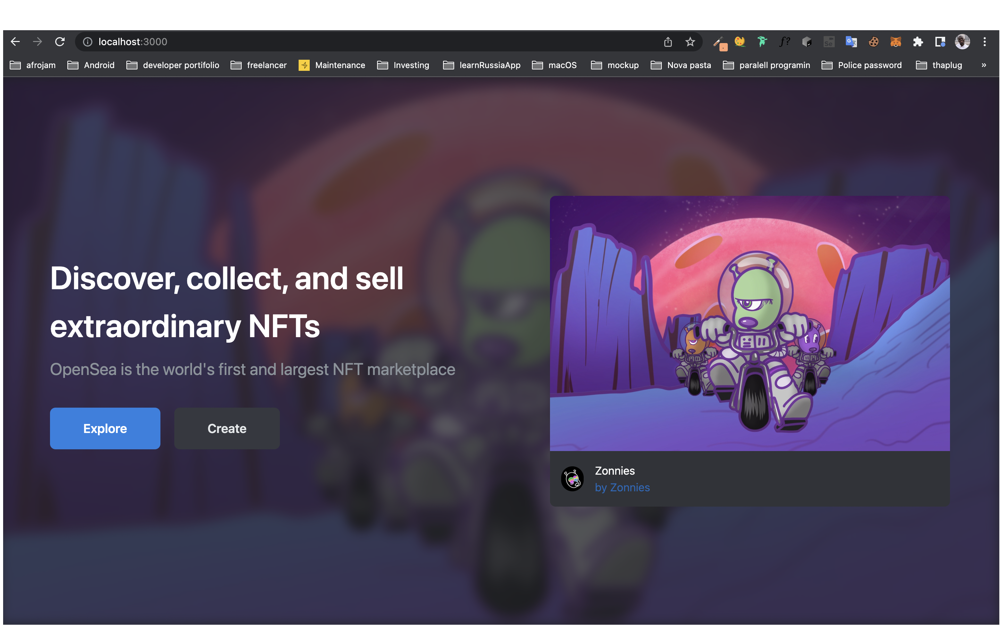

# OpenSea-clone

## OpenSea

OpenSea offers a marketplace allowing for non-fungible tokens to be sold directly at a fixed price, or through an auction, based on the Ethereum ERC-721 standard, the layer-2 scaling solution for Ethereum Polygon, the KIP-7 standard for Klaytn, and the SPL standard for Solana

## Poject Description

- OpenSea is a decentralized peer-to-peer marketplace for buying, selling and trading rare digital goods, from gaming items to collectibles to art, which are built on non-fungible token (NFT) technology and run on the Ethereum blockchain.
- Mint. To ‘mint’ an NFT which means to create the digital representation of something and its belonging to the blockchain.
- Burn. Which allow you to send the token to a ‘black hole’ account with no-access to the public, whom can only check the balance but not its content.
- Pause. Allows you to pause the transfers of the NFT, what could be useful if for any reason you would like to stop the marketability of the asset.
- Transfer. Needed to transfer and keep a trace of the asset in the blockchain.
- Add Metadata. Return a token URI. Our token URI will be baseUri + tokenId, which will be automatically added and increased with every minting.

# Project Results

### OPENSEA CLONE LINK

- https://opensea-bloackchain-clone.vercel.app

# Getting Started

### Dependencies

- please install all the dependencies using yarn install

### Installing

- clone this repository by using git clone https://github.com/judinilson/opensea-clone.git
- then cd/opensea-clone folder then install the dependencies
- then cd/studio folder then install the sanity dependencies

### Executing program

- To run it use the following command
- for server npm run dev
- for studio server sanity start
